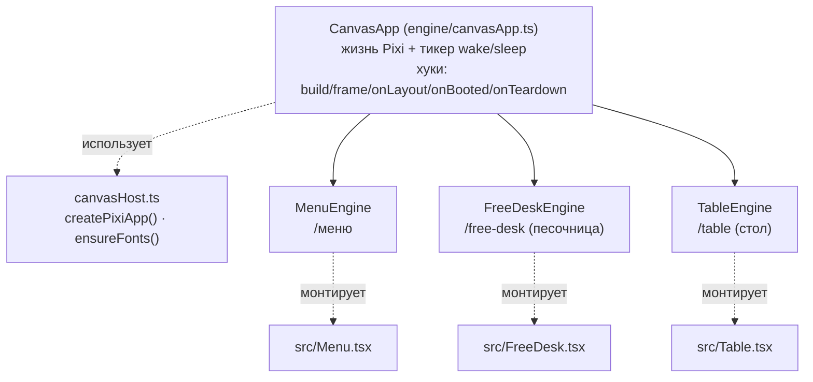
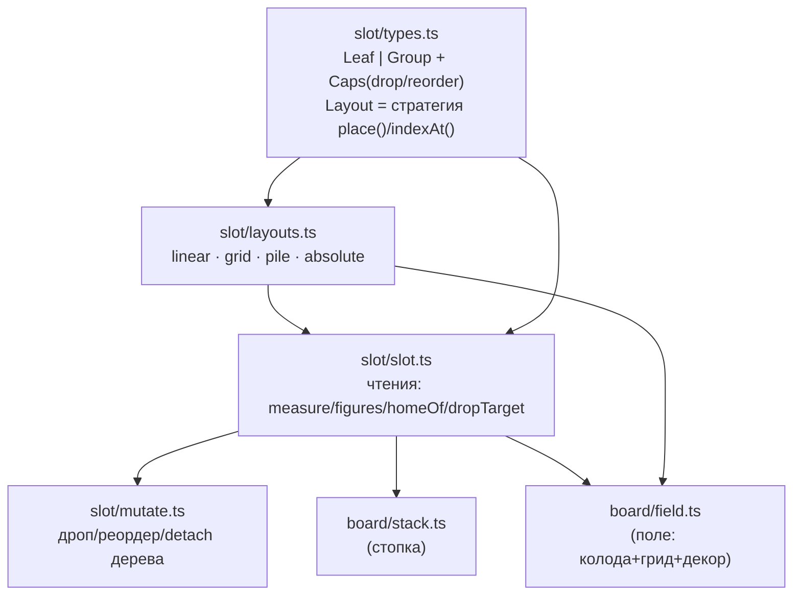

# Карта атомов — client2

Справочник: какие атомы (модули) есть в `client2`, что каждый знает и чего НЕ знает, что
конфигурируется/генерик, как масштабируется, и **кто их всех сшивает**. Плюс worked-example —
как из этих атомов собрана песочница `/free-desk`.

Спутник [`HANDOFF.md`](./HANDOFF.md) (где мы сейчас) и [`open-tasks.md`](./open-tasks.md) (хвосты).
Общая доктрина — корневой `CLAUDE.md`.

> 💬 **Как читать.** Таблицы — для беглого просмотра (атом → зачем → знает/не знает → конфиг →
> масштаб). Под каждой таблицей `<details>` с **реальными сигнатурами из кода** (`file:line`) —
> раскрой, когда надо «а как это написано». Мои заметки идут как `> 💬`.

> ⚠️ Код `client2` активно меняется (последнее — E6 «реестр элементов тип→визуал», E5 concealable/
> значения). Строки/номера сверены на текущем дереве; при расхождении верь коду, не этому файлу.

---

## 0. TL;DR — три вещи, которые надо понять первыми

1. **Кто сшивает: `CanvasApp` (Host).** «Глупая» база: владеет только жизнью Pixi и циклом кадра
   (`wake`/`sleep`). Про карты/сцену не знает — контент реализует хуки `build()`/`frame()`. Три
   движка (`MenuEngine`, `FreeDeskEngine`, `TableEngine`) — это `extends CanvasApp`.
2. **Атомы «глупые», общаются через контракты (DIP).** Драг/метки/пул/слои не знают про `Card` —
   они знают интерфейсы `element.ts` (`TableElement`, `Draggable`, `Flippable`…). `Card` и `Piece`
   их *реализуют* → встают в любую систему без её правок. Новый вид элемента = реализовать контракт.
3. **Шов «чистое ↔ Pixi».** Половина атомов — чистая CPU-математика без Pixi (тестируется юнитами):
   пружина, раскладки слотов, правила бордов, политика меток, геометрия флипа/тени. Pixi-атомы —
   тонкая оболочка поверх них. Это и есть будущий `engine-kit` (шов headless/canvas, см. память).

---

## 1. Сшивка: Host + движки



`CanvasApp` — template method: скелет один, «мясо» в хуках контента.

| Хук | Когда | Обязателен |
|---|---|---|
| `onLayout(w,h)` | до boot — производные размеры (размер карты от экрана) | нет |
| `build(app)` | собрать сцену в `app.stage` + навесить ввод | **да** |
| `onBooted(app)` | первый render / wake / эмит вида | нет |
| `frame(dt)→moving` | кадр: шаг+рендер; `false` → цикл засыпает | **да** |
| `onTeardown(app)` | отвязать слушатели, почистить свои узлы | нет |

> 💬 `MenuEngine` — единственный движок, который НЕ наследует `CanvasApp` (держит свой `app`/`ticker`/
> `mount`). Историческое: он появился до выноса Host (E1). Кандидат домигрировать под ту же базу.

<details>
<summary>Реальный код — Host</summary>

```ts
// engine/canvasApp.ts
11  export abstract class CanvasApp {
18    async mount(host: HTMLElement, width: number, height: number): Promise<void>
61    protected wake(): void { if (this.app && !this.app.ticker.started) this.app.ticker.start(); }
75    protected abstract build(app: Application): void;
81    protected abstract frame(dt: number): boolean;   // вернуть moving; false → ticker.stop()

// engine/canvasHost.ts
10  export async function ensureFonts(): Promise<void>          // ждём Handjet ДО первого рендера
22  export async function createPixiApp(width, height): Promise<Application | null>
```
Ключевое: `boot()` поднимает СВЕЖИЙ WebGL-контекст на каждый `mount` (StrictMode «теряет контекст»).
</details>

---

## 2. Шов «чистое ↔ Pixi» (headless / canvas)

Ключ к портируемости (движок-как-либа). «Чистый» = не импортит Pixi, тестируется без WebGL.

| Слой | Атомы |
|---|---|
| **Чистая математика (CPU, юнит-тест)** | `physics/spring`, `anim/config`, `anim/easing`, `flip`, `plane`, `card`, `cardFace`, `symbols` (данные), `slot/*` (types/slot/layouts/mutate), `board`, `container`, `containerConfig`, `boardLayout`, `boardModel`, `boardPresets`, `dropResolve`, `dynamicGrid`, `bounds`, `slotLayout`, `layout/grid`, `layout/slots`, `selection`, `actionFold`, `solitaireRules`, `markerPolicy`, `tableAssemble`, `tableSide`, `sandboxLayout`, `cardHit`, `viewport`, `inputRouter`, `censorMotion`, `censorConfig`, `effects/burn`, `effects/pieceShadow` |
| **Pixi-оболочка (рисует/держит узлы)** | `canvasApp`, `canvasHost`, `*Engine`, `sceneLayers`, `elementPool`, `marker`, `drag`, `panZoom`, UI-kit (`Card`,`Piece`,`Button`,`Toggle`,`Stepper`,`DropZone`,`ShadowLayer`,`controls`,`CardTextureCache`,`cardTextures`), `CardBody`(держит спрайт-цели), `field`/`fieldPaint`, `censorField`/`censorGpu`/`censorParticles`/`censorSource`, `fingerContent` |

> 💬 `markerPolicy` (`shouldShow` = enum+switch) — эталон куска, который ляжет на Swift/Java 1:1.
> `CardBody` формально «чистое тело-пружина», но живёт на границе: спрайт лишь читает его `px/py/rot`.

---

## 3. Атомы по кластерам

### 3A. Ввод · камера · драг · контракты

| Атом | Зачем | Знает / НЕ знает | Конфиг · генерик | Масштаб · где |
|---|---|---|---|---|
| `engine/element.ts` | **контракт** управляемого элемента (вместо `Card`), разбит по способностям (ISP) | знает Pixi `Container`, `CardBody` / сам ничего не делает | `TableElement` + опц. `Draggable`/`Flippable`/`Burnable`/`Concealable`/`Valued` | новый элемент реализует нужные → встаёт в системы; реализуют `Card`,`Piece` |
| `engine/inputRouter.ts` | стейт-машина жестов none/drag/pan/pinch/button/hover | ничего не импортит / ни Pixi, ни домена | generic `<C,B>`; ~20 колбэков `InputHandlers` | реюз песочница/стол; тест без Pixi |
| `engine/drag.ts` | груз драга (одна карта / пачка) поверх `TableElement` | знает `element` / не знает слои/дома (это `DragContext`), не знает `Card` | `SingleDrag`/`GroupDrag`; способности рантайм-проверкой | новый элемент — просто реализует контракт |
| `engine/marker.ts` | метка слота: драггер-ручка / якорь-дом над `MarkerHost` | Pixi + `markerPolicy` + `DragPayload` / не знает `Card` | `withDragger`/`withAnchor`; `MarkerConfig` | навешивается на соло/стопку/фигуру одинаково |
| `engine/markerPolicy.ts` | **чистая** политика видимости метки | ничего / ни Pixi, ни рисования | `ShowPolicy` = `always/atHome/away/empty/gone` | кусок core↔canvas-шва |
| `engine/elementPool.ts` | единый пул по идентичности (1 визуал на id, боксы = якоря покоя) | `CardTargets` / ни Pixi, ни «что это карта» | generic `<V extends {body:SpringBody}>`; колбэки create/anchor/enter/leave | перелёт между боксами без пересоздания; для стола |
| `engine/cardHit.ts` | хит-тест: среди накрывших точку побеждает верхний по z | ничего / ни Pixi, ни карт | `HitBox{px,py,hw,hh,z}` | — |
| `engine/viewport.ts` | **чистая** математика камеры (x/y/zoom + границы + инерция) | ничего / ничего не рисует | `(minZoom,maxZoom,topInset)`; fling-инерция | тест без WebGL; отдаёт `ViewState` скроллбарам |
| `engine/panZoom.ts` | атомарный приклеиваемый пан/зум одной функцией | Pixi + `InputRouter`+`Viewport` / драг элементов не делает | generic `<B>`; `attachPanZoom(app,content,opts)` | кнопки через `opts.buttons` (арбитраж с паном) |

<details>
<summary>Реальный код — 3A</summary>

```ts
// engine/element.ts
11  export interface TableElement {            // root, body, state, id, footprint…
25  export interface Draggable { … }           56  export interface Burnable { … }
// engine/inputRouter.ts
40  export class InputRouter<C, B> {           13  export interface InputHandlers<C, B> { … }
// engine/drag.ts
15  export interface DragContext { raise; returnHome; flipGroup }
38  export class SingleDrag implements DragPayload {     72  export class GroupDrag implements DragPayload {
// engine/marker.ts
110 export function withDragger(host, restLayer, dragLayer, cfg): Marker
114 export function withAnchor(host, restLayer, cfg): Marker
// engine/markerPolicy.ts
21  export function shouldShow(policy: ShowPolicy, s: MarkerState): boolean
// engine/elementPool.ts
51  export class ElementPool<V extends { body: SpringBody }> {     89  apply(next: readonly Slot[]): ApplyResult
// engine/cardHit.ts
14  export function topmostAt(boxes: readonly HitBox[], cx, cy): number
// engine/viewport.ts
21  export class Viewport {   62  zoomAround(sx, sy, factor)   114  stepFling(dt): boolean
// engine/panZoom.ts
45  export function attachPanZoom<B>(app, content, opts): PanZoomHandle
```
</details>

> 💬 Это ядро «атомы через контракты». `drag`/`marker`/`elementPool`/`cardHit` НЕ импортят `Card` —
> отсюда и «фишки/фигуры/карты — один драг». Если начнёшь пилить сетевой слой — он тоже войдёт
> через `element.ts`-контракт (напр. `Valued.setValue`), не через движок.

### 3B. Тело · пружины · анимация (ядро твоего вопроса про springs)

| Атом | Зачем | Знает / НЕ знает | Конфиг · генерик | Масштаб · где |
|---|---|---|---|---|
| `physics/spring.ts` | **ядро пружин**: демпфированная пружина по ОДНОМУ каналу | `SpringConfig` / **чистая CPU-математика, Pixi не трогает** | `snap` (телепорт), пороги оседания | 1 канал → гоняется по x/y/rot/scale |
| `CardBody.ts` | карта как физ-объект: 4 пружины + инерционный крен | `anim`, `stepSpring` / не Pixi-нода (спрайт читает `px/py/rot`) | `CardTargets{x?,y?,rot?,scale?}`; `tiltScale` 1/0 | каналы независимы; крен из скорости x |
| `anim/config.ts` | **единый источник** тайминга/жёсткости всех анимаций | ничего / чистые данные | `as const` `anim`: posSpring/rot/scale, tilt, deck, fan, shuffle, flip, idle… | `priority{idle,shuffle,deal}` — задел вытеснения |
| `anim/easing.ts` | ease-out для time-warp растасовки | ничего / чистая | `easeOutQuad(u)` | — |
| `flip.ts` | перевороты и «тянучка»: чистая математика 2D-матриц | `anim.flip` / движок только рисует | `flipTransform`, `spinAngle/Scale`, `Transform2D` | ортопроекция поворота 3D |
| `ui/plane.ts` | чистые ф-ции «план элемента → вид» (масштаб покоя + силуэт тени) | константы / не Pixi | `scaleForState(s)`, `shadowSilhouette(i)` | маппинг вынесен из элемента, покрыт тестом |

<details>
<summary>Реальный код — 3B (springs)</summary>

```ts
// physics/spring.ts — шаг пружины (полу-неявный Эйлер), ЧИСТЫЙ CPU
11  export function stepSpring(state, target, cfg, dt, snap = false): SpringState {
24    const force = -stiffness * (state.pos - target) - damping * state.vel;
25    const vel   = state.vel + force * dt;
26    const pos   = state.pos + vel * dt;
31  export function isSettled(state, target, posEps=0.05, velEps=0.05): boolean

// anim/config.ts
5   export interface SpringConfig { stiffness: number; damping: number; }
15  posSpring: { stiffness: 120, damping: 14 } as SpringConfig,

// CardBody.ts
56  step(dt, snap=false): void {
57    this.cx = stepSpring(this.cx, this.tx, anim.posSpring, dt, snap);   // и cy/crot/cscale
78  get rotation(): number {   // крен = clamp(vel.x * tilt.factor * tiltScale) + пружина поворота
```
</details>

> 💬 **Прямой ответ на твой первый вопрос (springs слабый/сильный режим).** Пружина — вот эти 3
> строки `spring.ts:24-26`, чистый CPU, копейки. «Сильный режим» = гонять `stepSpring` к цели;
> «слабый» = `body.snapTo(target)` (телепорт, `snap=true`). Рисует всё равно GPU (Pixi) в обоих.
> Профиль качества по сути дёргает флаг `snap`/`tiltScale`. Драг/дроп читают ЦЕЛЬ (`setTarget`),
> не текущую пружинную позицию — поэтому пружинная задержка не мажет по хит-тесту.

### 3C. Модель доски — фундамент `slot/*` (Composite + Strategy)

Сердце всей доски. «Стопка / грид / куча / поле / борд» — это **один слот-узел с разной Layout-
стратегией**, не разные классы. Чистая модель без Pixi.



| Атом | Зачем | Знает / НЕ знает | Конфиг · генерик | Масштаб · где |
|---|---|---|---|---|
| `slot/types.ts` | рекурсивная модель слота (лист/группа) + способности (EC) | ничего / без Pixi, без правил игры | `Layout`(place/indexAt); `Caps{drop,reorder}`; `leaf()`/`group()` | новая способность = ключ в `Caps`, тип слота не трогаем |
| `slot/layouts.ts` | **Layout-стратегии**: вся геометрия группы | `dynamicGrid` / без Pixi | `linear`(1D, gap<0=нахлёст), `grid`(2D flow, живые геттеры), `pile`(куча), `absolute` | новый «тип контейнера» = новая стратегия, не класс |
| `slot/slot.ts` | чистые ЧТЕНИЯ по дереву (дома/хит-тест/дропзона) | `types` / без Pixi | `homeOf`, `dropTarget`, `figures`, `measure` | геометрия ВЫТЕКАЕТ рекурсивно — per-container кода нет |
| `slot/mutate.ts` | МУТАЦИИ дерева на дропе (реордер/перенос/detach) | `slot`,`types` / без Pixi | `dropInto(root,figure,cp)` учитывает accept/cap/reorder | лист путешествует между группами |
| `board/board.ts` | иммутабельная модель поля слотов (ключ→Container) под server-sync | `container` / не знает геометрию/Pixi/лица | `onEmpty: collapse/keep`; `MakeContainer` фабрика | новые исходы дропа — слоем Action выше |
| `board/container.ts` | логический атом слота: список членов + правила приёма | ничего / без Pixi/лиц/геометрии | `Container{members,maxSize?,locked?,accepts?}` | `accepts(id)` — вид-правило |
| `board/dynamicGrid.ts` | flow-грид: упаковка по индексу в прямоугольник, границы min/max | ничего / чистая математика | `GridSpec{cols,rows,grow,reserve}`; max мягкий (не теряем карту) | направление роста — данными |
| `board/layout/grid.ts` · `layout/slots.ts` | геометрия фикс-сетки (r,c) + стратегии `gridSlots`/`ringSlots` | `grid`↔`slots` / без Pixi | `GridSpec`, `PositionedSlot` | новая стратегия = новая функция → `PositionedSlot[]` |
| `board/bounds.ts` · `slotLayout.ts` | кламп фигуры в рамку · смещения центрированной стопки | ничего / чистые | `clampToBounds`, `stackOffsets(count,dx,dy)` | веерная раскладка — позже |

<details>
<summary>Реальный код — 3C фундамент</summary>

```ts
// slot/types.ts
17  export interface Layout { place(sizes): {at,size}; indexAt(cp,sizes): number|null }
49  export type Slot = Leaf | Group;    39 export interface Caps { drop?; reorder? }
77  export const leaf = (id, figure, size, caps?) => …    78 export const group = (id, layout, children, caps?) => …
// slot/layouts.ts
7   export function linear(o): Layout       48 export function grid(o): Layout   // живые геттеры cols/rows/reserve
75  export function pile(o): Layout         101 export function absolute(offsets): Layout
// slot/slot.ts
44  export function homeOf(s, figure, origin): Vec | null      // смещения копятся корень→лист
73  export function dropTarget(root, cp, origin): { group, index } | null
// slot/mutate.ts
31  export function dropInto(root, figure, cp): { moved, reordered }
// board/board.ts
55  export function move(b, fromKey, toKey, ids, mk = bareContainer): Board
// board/dynamicGrid.ts
50  export function flowLayout(count, g, spec): { centers, size, cols, rows }
```
</details>

> 💬 Это самый сильный кусок архитектуры. `homeOf` рекурсивно выводит «дом» карты из дерева, а
> движок просто ставит туда пружинную цель — **одинаково** для стопки, грида и поля. Хочешь новую
> раскладку (кольцо/веер) — пишешь одну `Layout`-стратегию в `slot/layouts.ts`, всё остальное даром.

### 3D. Доска — правила и зоны (данные-driven, задел BoardFactory)

| Атом | Зачем | Знает / НЕ знает | Конфиг · генерик | Масштаб · где |
|---|---|---|---|---|
| `board/boardZone.ts` | стейт-ное ядро полигона: состояние board + поведение дропа | `board`,`container`,`dropResolve`,`bounds`,`slotLayout` / без Pixi | `OnOccupied` merge/swap/capture/reject (на лету); `AcceptRule` | новые исходы = ветка `switch`; резолвер сменный |
| `board/boardPresets.ts` | **пресеты бордов как данные** (разные игры = разный конфиг) | `boardZone`,`cardFace`,`solitaireRules` / без Pixi/координат | `BoardPreset`; 8 пресетов (merge/дурак/пятнашки/capture/ring/пасьянс) | новая игра = элемент массива `BOARD_PRESETS` |
| `board/boardLayout.ts` | чистая геометрия борда из пресета (grid/ring) → слоты+рамка | `layout/slots` / без Pixi/содержимого | `BoardLayoutOpts{left,top,cardW,cardH}` | новая стратегия = ветка `preset.layout` |
| `board/boardModel.ts` | пресет-данные → логическая модель (id фигур + id→лицо) | `board`,`boardPresets`,`boardZone` / без геометрии/Pixi | `idPrefix`; `wrapRule` (value-правило → id-правило) | — |
| `board/dropResolve.ts` | резолвер цели при перекрытии: priority→depth→z | ничего / чистая, генерик `<P>` | `DropCandidate<P>`; `accepts=false`=прозрачно | заменяем хуком `BoardPolicy` |
| `board/containerConfig.ts` | глобальный конфиг контейнера (тоглеры на все фигуры) | ничего / **пока не подключён к движку** | `GrabMode`, `SelectSort`, `DEFAULT_CONFIG`, `resolveConfig` | задел |
| `board/selection.ts` | мультивыделение, изолированное на один scope | ничего / без Pixi/правды | `ordered(sel,cmp?)`; изоляция `owner===scope` | — |
| `board/actionFold.ts` | свёртка Action (burn/flip) по членам по способности | ничего / **только тесты, не в движке** | `Fold = all/each/container/block/fn` | новый режим = пресет-литерал или функция |
| `board/solitaireRules.ts` · `cardFace.ts` | правила Клондайка (A=1) · value-хелперы лица | `cardFace` / без Pixi | предикаты `tableauAccepts`/`foundationAccepts`; `rankOf`/`cardColor` | правила-как-данные |
| `board/stack.ts` | СТОПКА: контейнер на дереве слотов, без декора | `slot/*`,`controls` / не знает декор/Card/перенос | `{left,top,cell,step,ids,reorder?}`; `params()`=тумблер | реордер «даром» от грид-группы |
| `board/field.ts` | ПОЛЕ: контейнер-адаптер (колода+грид) + декор-дропзона | `slot/*`,`dynamicGrid`,`fieldPaint`,`controls` / не знает Card-визуалы/spring | `FieldConfig`+пресеты `NAKED_FIELD`/`NORMAL_FIELD`; `FieldDecor` | новый стиль = новый `FieldConfig`, без подклассов |
| `board/fieldPaint.ts` | вся Pixi-графика декора Поля (рамки/якорь/глаголы) | Pixi + типы `field` / не знает порядок/дроп | вход `FieldDecor|null` + `dragState` | стиль данными decor, не кодом |

<details>
<summary>Реальный код — 3D</summary>

```ts
// board/boardZone.ts
15  export type OnOccupied = "merge" | "swap" | "capture" | "reject";
38  export class BoardZone {   87 dropAt(figureId, x, y): { moved, captured? }
// board/boardPresets.ts
10  export interface BoardPreset {   29 export const BOARD_PRESETS: BoardPreset[] = [ … ]
// board/boardLayout.ts
14  export function layoutForPreset(preset, o): { positioned, bounds }
// board/boardModel.ts
7   export function buildBoardModel(preset, idPrefix): { slots, faces }
24  export function wrapRule(presetRule, faces): AcceptRule | undefined
// board/dropResolve.ts
16  export function resolveDrop<P>(candidates, x, y, payload): DropCandidate<P> | null
// board/stack.ts
10  export class Stack implements Configurable { … }
// board/field.ts
88  export class Field implements Configurable {   269 place(id, cp): { moved, flip }
```
</details>

### 3E. UI-kit — виджеты канваса

| Атом | Зачем | Знает / НЕ знает | Конфиг · генерик | Масштаб · где |
|---|---|---|---|---|
| `ui/Card.ts` | карта UI-kit: тело-пружина + план + флип + пыль + сжигание | `CardBody`,`flip`,`plane`,`burn`,`ParticleField`,`CardTextureCache` / не знает ввод/слои/сеть | `CardOptions` (faceUp/back/faceStyle/hidden/custom/rest…) | реализует 6 контрактов-способностей; кастом-лица `CUSTOM_FACES` |
| `ui/Piece.ts` | НЕ-карточный элемент (фишка/фигура): то же тело/тень, без Flippable | `CardBody`,`plane`,`pieceShadow`,`burn`,`element` / не знает флип/текстур-кэш | `PieceOptions{id,w,h,build,shadow,rest?}`; фабрики `drawChip`/`drawChessPiece` | визуал инъектится через `build` → встаёт на место карты |
| `ui/pieceKinds.ts` | реестр «тип фигуры → визуал» (build + силуэт тени) | `Piece` фабрики / — | `PieceSpec` union (chip/chess); `pieceVisual(spec,r)` | новый вид = ветка в `switch` + вариант union |
| `ui/Button.ts` | канвас-кнопка: варианты/размеры/состояния, ввод ведёт движок | Pixi + `PIXEL_FONT` / не слушает pointer сама | `ButtonOptions` variant/size/disabled; таблицы `VARIANTS`/`SIZES` | новый вариант = строка в таблице |
| `ui/Toggle.ts` · `Stepper.ts` | вкл/выкл · числовой `[−] val [+]` | Pixi + `Button` / не слушают ввод | `ToggleOptions` · `StepperOptions{min,max,format?}` | отдают кнопки движку через `buttons()` |
| `ui/DropZone.ts` | дропзона на 2 плана: фон+имя под картами, глагол над | Pixi / не делает hit-логику дропа | `{name,verb,rect}`; `setHot` имя↔глагол | — |
| `ui/controls.ts` | **генерик-контроллеры**: компонент декларирует `params()`, адаптер рендерит | `Stepper`,`Toggle` / не знает конкретику | `Configurable`{params()}, `ControlsHost`; `attachControls` | DIP: любой `Configurable` получает UI даром |
| `ui/ShadowLayer.ts` | слитая тень уровня: силуэты → маска, 1 заливка сквозь неё | Pixi + `SHADOW_*` / не считает силуэты | `update(shapes,w,h)` | правило «тени не складывают альфу» едино |
| `ui/CardTextureCache.ts` | кэш запечённых текстур (лицо/рубашка/скрытые/кастом/тень/пыль) | Pixi + `cardTextures`,`censorSource` / не рисует сам | ключ лица `card|fourColor|style`; ленивые singletons | кастом-лица через `CUSTOM_FACES`; `destroy()` |
| `engine/cardTextures.ts` | фабрики текстур (symbol/pips, скрытое, джокер, рубашки, тень) | Pixi + `card`,`symbols`,`cardBack`,`pipLayout` / не кэширует | `FaceStyle`; реестр `CUSTOM_FACES` | новое лицо = фабрика в `CUSTOM_FACES` |

<details>
<summary>Реальный код — 3E</summary>

```ts
// ui/Card.ts
65  export class Card implements TableElement, Draggable, Flippable, Burnable, Concealable, Valued {
96    constructor(opts: CardOptions, tex: CardTextureCache, baseScale: number)
// ui/Piece.ts
25  export class Piece implements TableElement, Draggable, Burnable {
138 export function drawChip(root, radius, color, label)     // + drawChessPiece
// ui/pieceKinds.ts
19  export function pieceVisual(spec: PieceSpec, r: number): PieceVisual
// ui/Button.ts
42  export class Button {   101 hitTest(cx, cy): boolean       // движок дёргает hitTest/hover/setPressed/click
// ui/controls.ts
28  export function attachControls(cfg: Configurable, host, at): { bottom, toggles }
// ui/CardTextureCache.ts
16  export class CardTextureCache {   62 face(card, fourColor, style): Texture
// engine/cardTextures.ts
247 export const CUSTOM_FACES: Record<string, (app) => Texture> = { joker: … }
```
</details>

### 3F. Цензура · эффекты · карты-данные

| Атом | Зачем | Знает / НЕ знает | Конфиг · генерик | Масштаб · где |
|---|---|---|---|---|
| `censorConfig.ts` | **единый источник** цензуры скрытой карты (дефолт TG-пыль) | `ParticleParams` / без Pixi | `DANCE_DEFAULT` (5/25/1/1), `DUST_FLICKER=false`, `DUST_TIME_SCALE=1/3`, `dustParams/dustPoints` | один источник для стенда И доски |
| `censorMotion.ts` | чистая математика цензуры (свапы/сдвиг рядов/дрожание) | ничего / ни Pixi, ни состояния | `CensorKind`, `CENSOR_PRESETS`, `GOLDEN` | источник-агностик (сетка cols×rows) |
| `engine/censorField.ts` | генерик CPU-рендер: рисует блоки по `censorMotion` каждый кадр | Pixi + `censorMotion` / не знает карты | `CensorSource{cols,rows,block,on[],color}` | легко до пер-блочного цвета |
| `engine/censorGpu.ts` | GPU-варианты (шейдер): remap (стейтлес) / pingpong (поле смещений) | Pixi/GL + `fingerContent`,`censorConfig` / — | `GpuMode`; рычаги `DanceParams`→uniform'ы | CPU≈0 в remap |
| `engine/censorParticles.ts` | Telegram-пыль: частицы поверх силуэта | Pixi + `AMBER` / не считает спавн-точки | `ParticleParams{dot,drift,life,twinkleHz,flicker,timeScale}` | позиция/alpha = чистая функция возраста |
| `engine/censorSource.ts` | извлечение силуэта фака в сетку/облако точек (Pixi-мост) | Pixi + `fingerContent`,`censorConfig` / не анимирует | `buildFingerGrid`, `buildFingerDustPoints` | вынесено из чистого config (нужен рендер) |
| `fingerContent.ts` | лицо скрытой карты (амбер «?» + фак), общий источник | Pixi + `symbols`,`constants` / фон не рисует | `AMBER`, `drawFinger(flip)`, `buildContent` | — |
| `symbols.ts` | SVG-масти+палец, единый источник Pixi и HTML | `Suit` / без Pixi/DOM | `SUIT_PATH`, `symbolCanvasSvg` (Pixi) vs `suitSvg` (HTML) | — |
| `effects/burn.ts` | «сжечь»: чистая математика кадра (замирание+дрожь→расход) | `TEX_*` / без Pixi | `BURN_*`, `burnFrame(t,age,width)` | две фазы, волнистый фронт |
| `effects/pieceShadow.ts` | тень-эллипс у основания фишки/фигуры | `ShadowShape` / чистая | `pieceSilhouette(input)`; свет справа | — |
| `card.ts` | разбор строки карты + цвет масти | ничего / чистая | `SUITS`, `parseCard`, `suitColor(fourColor)` | четырёхцветная для слабовидящих |

<details>
<summary>Реальный код — 3F</summary>

```ts
// censorConfig.ts
19  export const DANCE_DEFAULT: DanceParams = { block: 5, swapsPerSec: 25, jitterAmp: 1, jitterFreq: 1 };
48  export function dustPoints(on, cols, rows, step, perCell, cx, cy): Array<{x,y}>
// censorParticles.ts
28  export class ParticleField {   74 update(t): void        // alpha/pos = f(age), timeScale замедляет
// engine/censorGpu.ts
14  export type GpuMode = "remap" | "pingpong";    93 export class GpuCensorCard {
// effects/burn.ts
23  export function burnFrame(t, age, width): BurnFrame
// card.ts
12  export function parseCard(s: string): Card    22 export function suitColor(suit, fourColor): number
```
</details>

### 3G. Стол · сборка · константы (движок `TableEngine`)

| Атом | Зачем | Знает / НЕ знает | Конфиг · генерик | Масштаб · где |
|---|---|---|---|---|
| `engine/tableEngine.ts` | автономный стол: пул по идентичности + драг между deck/hand/play/discard | `CardBody`,`ElementPool`,`assembleTable`,`cardTextures` / **не знает сеть** («следующим слоем») | `ElementPool<CardVisual>`, `InputRouter<string,never>` | состояние — 4 массива → плоские слоты |
| `engine/tableAssemble.ts` | чистая сборка плоского `Slot[]` из 4 массивов (карта не теряет id) | тип `Slot` / без Pixi/сети | `assembleTable(deck,hand,discard,play)` | `play` → боксы `play:N` |
| `engine/tableSide.ts` | чистые правила: какой стороной лежит карта + переворот при переезде | ничего / display-правило клиента | `boxFaceUp`, `flipForMove` | hand/play → лицом |
| `engine/sceneLayers.ts` | слои по «плану» (высота над столом) + слитые тени под уровнем | Pixi + `ShadowLayer` / не знает сеть | `Level = idle/floating/fan/drag`; `SceneLayers(content)` | добавить план = расширить `Level` |
| `engine/sandboxLayout.ts` | чистая вёрстка блоков «Управление» (fit) + сдвиги пачки | ничего / без Pixi | `fitBlock`, `squeezeOffsets` | — |
| `engine/constants.ts` | общие числа/строки движка (текстура, тени, шрифт, палитра, z) | ничего / лист-модуль | `TEX_W/H`, `DRAG_SCALE`, `PIXEL_FONT`, `COLORS`, `Z` | одни числа для всех отрисовочных модулей |
| `engine/types.ts` | общие типы (`CardVisual`, `BoardPile`, `FanGeom`…) | Pixi/`CardBody` / — | `BoardPile = deck/discard/play:N` | — |

<details>
<summary>Реальный код — 3G</summary>

```ts
// engine/tableEngine.ts
35  export class TableEngine extends CanvasApp {
196 private rebuild(snap=false): void { const slots = assembleTable(this.deck, this.hand, this.discard, this.play);
// engine/tableAssemble.ts
11  export function assembleTable(deck, hand, discard, play): Slot[]
// engine/tableSide.ts
12  export function boxFaceUp(box: string): boolean    29 export function flipForMove(from, to): MoveFlip
// engine/sceneLayers.ts
13  export function levelOf(s: CardState): Level    27 export class SceneLayers { 62 place(root, level) }
// engine/constants.ts
5   export const TEX_W = 160;   51 export const DRAG_SCALE = 1.45;   122 export const Z = { … }
```
</details>

---

## 4. Worked example — как собрана песочница `/free-desk`

`FreeDeskEngine` (`engine/freeDeskEngine.ts`, ~1800 строк — самый большой атом, это Host всей
песочницы) наглядно показывает всё вышесказанное в работе.

### 4.1 Жизненный цикл (наследует `CanvasApp`)

```
onLayout(w,h)  → размер карты от экрана (cardH, baseScale, cardW)      :237
build(app)     → tex=CardTextureCache · content=Container · SceneLayers · buildContent()   :257
onBooted()     → clampView · applyView · render · wake · emitView       :267
frame(dt)      → шаг пружин всех тел + камера (fling) → moving?         (в CanvasApp.tick)
```

### 4.2 Контент = ДАННЫЕ, движок один

`buildContent()` (`:333`) собирает ряды сверху вниз; каждый ряд — **список данных**, не хардкод:

| Ряд | Источник-данные | Атомы |
|---|---|---|
| «Карты — варианты» | `STORIES: Story[]` (12 спеков `CardOptions`) | `Card`, `CardTextureCache` |
| «Стопки» | 3× разные `ShowPolicy` меток | `Stack` + `Marker`(`withDragger`/`withAnchor`) |
| «Фишки и фигуры» | `PieceRowItem[]` (`el.kind` card/piece/stack) | `Piece` + `pieceKinds` + `Marker` |
| «Поле» | `FieldConfig` (`NORMAL_FIELD` + правки) | `Field` (→ `slot/*`, `dynamicGrid`) |
| «Игровые зоны» | `BOARD_PRESETS[]` | `BoardZone` + `boardModel`/`boardLayout` |
| «Дропзоны» | 2× `DropZone` | зона реагирует на способности груза |
| «Управление» | демо публичного API | `flipCard`/`setConcealed`/… |

> 💬 Вот доказательство «разные данные — один движок»: ряд фишек (`buildPieces` `:767`) диспетчит
> `el.kind` ОДНИМ циклом — задел под будущий `BoardFactory`. Конь носит метку так же, как стопка карт
> (`withDragger`/`withAnchor` generic по `MarkerHost`).

### 4.3 Публичное API доски — чем сервер / скрытая логика двигает карты

Всё через ту же пружину, что и палец (`body.setTarget` → `stepSpring`):

```ts
// engine/freeDeskEngine.ts
504  flipCard(id): void                    // «игрок открыл карту»; не-Flippable игнор
510  moveCard(id, x, y): void              // body.setTarget({x,y,rot:0}) → пружина
518  setConcealed(id, v): void             // скрытость ставится/снимается ИЗВНЕ (Concealable)
527  setCardValue(id, value): void         // сервер раскрыл придержанное; "" — снова придержать (Valued)
```

> 💬 Это тот самый шов «доска ↔ будущий сервер». API дёргает **способности** (`Flippable`/`Concealable`/
> `Valued`) через `byId.get(id)`, а не конкретный `Card`. Сеть, когда появится, войдёт сюда же —
> движок трогать не придётся. Демо-блоки «Управление» (`:549`–`:598`) — живые тесткейсы этого API.

### 4.4 Драг: контекст, а не хардкод

```ts
// dragCtx — движок-специфика для generic-груза (SingleDrag/GroupDrag):  :222
raise:      (el) => { el.setState("drag"); el.root.zIndex = 1e6; this.placeCard(el); }
returnHome: (el) => this.releaseElement(el)
flipGroup:  (els) => this.flipGroup(els)
```

`InputRouter<Elem, Button>` (`:219`) роутит жесты; `topmostAt` (`cardHit`) решает, за что схватились;
`SceneLayers.place(root, levelOf(state))` кладёт элемент в слой его «плана». Карта/фишка/фигура — всё
через `Elem = TableElement & Draggable`, конкретный класс системам безразличен.

---

## 5. Census — полный список (быстрый индекс)

Движки/Host: `canvasApp` · `canvasHost` · `freeDeskEngine` · `tableEngine` · `menuEngine`
Ввод/камера/драг: `inputRouter` · `panZoom` · `viewport` · `cardHit` · `drag` · `marker` · `markerPolicy` · `elementPool` · `element`
Тело/анимация: `CardBody` · `physics/spring` · `anim/config` · `anim/easing` · `flip` · `ui/plane`
Слоты (фундамент): `slot/types` · `slot/slot` · `slot/layouts` · `slot/mutate`
Доска-модель: `board/board` · `container` · `containerConfig` · `boardZone` · `boardModel` · `boardLayout` · `boardPresets` · `dropResolve` · `dynamicGrid` · `bounds` · `slotLayout` · `layout/grid` · `layout/slots` · `selection` · `actionFold` · `solitaireRules` · `cardFace` · `stack` · `field` · `fieldPaint`
UI-kit: `ui/Card` · `ui/Piece` · `ui/pieceKinds` · `ui/Button` · `ui/Toggle` · `ui/Stepper` · `ui/DropZone` · `ui/controls` · `ui/ShadowLayer` · `ui/CardTextureCache` · `engine/cardTextures` · `cardBack` · `pipLayout`
Цензура/эффекты: `censorConfig` · `censorMotion` · `censorField` · `censorGpu` · `censorParticles` · `censorSource` · `fingerContent` · `symbols` · `effects/burn` · `effects/pieceShadow`
Стол/сборка/константы: `tableAssemble` · `tableSide` · `sceneLayers` · `sandboxLayout` · `constants` · `types` · `card`

> 💬 Не разобраны детально (минорные текстур-хелперы, вложены в `cardTextures`): `cardBack.ts`
> (скины рубашки: lattice/mosaic), `pipLayout.ts` (раскладка «очков» на лице pips). React-хосты
> (`FreeDesk.tsx`/`Table.tsx`/`Menu.tsx`/`main.tsx`/`nav.ts`) — тонкие: монтируют движок + топбар/скроллбары.
